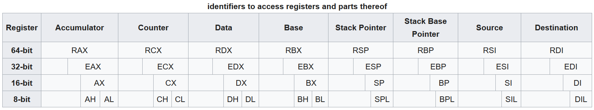

# Assembly X86 - 64-bit version of the x86 instruction set

[x86 Assembly Guide](https://www.cs.virginia.edu/~evans/cs216/guides/x86.html)

[x86 Assembly Wiki](https://en.wikibooks.org/wiki/X86_Assembly)

|Defintion|Description|
|---|---|
|Registers|Small areas of memory located on the CPU, where you can store and manipulate data|
|Memory|Where most of the state of an application will really be stored|
|Physical memory|RAM where the lowest address is 0x00000000 (0) and the highest is 0x03FFFFFF (67108863)|
|Virtual memory|An abstraction through which normal applications will access physical memory|
|Page table|Splits the address space of a process into a series of pages|
|Stack|Part of memory|
|Instructions|The basic unit of machine code. An instruction typically performs a single operation|
|Program counter (PC)|A register that tells the CPU which instruction to execute next|
|Calls||
|Syscalls|The fundamental interface between an application and the Linux Kernel|
|Shared libraries|Other binaries. These are DLLs in Windows, .so files on Linux, or dylibs on Mac|
|Disassembler|Turns machine code into readable text form (Assembly)|


## Registers

### General-Purpose registers (GPR)
Registers - accessible location in memory

|General-Purpose registers (GPR)|16-bit naming conventions|
|---|---|
|Accumulator register (AX)|Used in arithmetic operations|
|Counter register (CX)|Used in shift/rotate instructions and loops|
|Data register (DX)|Used in arithmetic operations and I/O operations|
|Base register (BX)|Used as a pointer to data (located in segment register DS, when in segmented mode)|
|Stack Pointer register (SP)|Pointer to the top of the stack|
|Stack Base Pointer register (BP)|Used to point to the base of the stack|
|Source Index register (SI)|Used as a pointer to a source in stream operations|
|Destination Index register (DI)|Used as a pointer to a destination in stream operations|



**Eflasgs**

The EFLAGS is a 32-bit register used as a collection of bits representing Boolean values to store the results of operations and the state of the processor. 

|Bit|Abbreviation|Flag|Description|
|---|---|---|---|
|0|CF|Carry Flag|Set if the last arithmetic operation carried (addition) or borrowed (subtraction) a bit beyond the size of the register. This is then checked when the operation is followed with an add-with-carry or subtract-with-borrow to deal with values too large for just one register to contain|
|2|PF|Parity Flag|Set if the number of set bits in the least significant byte is a multiple of 2|
|4|AF|Adjust Flag||Carry of Binary Code Decimal (BCD) numbers arithmetic operations|
|6|ZF|Zero Flag|Set if the result of an operation is Zero (0)|
|7|SF|Sign Flag|Set if the result of an operation is negative|
|8|TF|Trap Flag|Set if step by step debugging|
|9|IF|Interruption Flag|Set if interrupts are enabled|
|10|DF|Direction Flag|Stream direction. If set, string operations will decrement their pointer rather than incrementing it, reading memory backwards|
|11|OF|Overflow Flag|Set if signed arithmetic operations result in a value too large for the register to contain|
|12-13|IOPL|I/O Privilege Level field (2 bits)|I/O Privilege Level of the current process|
|14|NT|Nested Task flag|Controls chaining of interrupts. Set if the current process is linked to the next process|
|16|RF|Resume Flag|Response to debug exceptions|
|17|VM|Virtual-8086 Mode|Set if in 8086 compatibility mode|
|18|AC|Alignment Check|Set if alignment checking of memory references is done|
|19|VIF|Virtual Interrupt Flag|Virtual image of IF|
|20|VIP|Virtual Interrupt Pending flag|Set if an interrupt is pending|
|21|ID|Identification Flag|Support for CPUID instruction if can be set|

**Instruction Pointer (EIP)**

The IP register contains the address of the next instruction to be executed if no branching is done. IP can only be read trough the stack after a `call` instruction.

**Memory**
The x86 architecture is little-endian, meaning that multi-byte values are written least significant byte first. (This refers only to the ordering of the bytes, not to the bits.) 

## Assembler instructions 

### Data movement instructions
Some of the most important and most frequently used instructions are those that move data. Without them, there would be no way for registers or memory to even have anything in them to operate on. 
|Instruction|Example|Description|
|---|---|---|
|mov|`mov dest, src`|The mov instruction copies the `src` operand into `the` dest operand|
|lea|lea `dest`, `src`|The `lea` instruction calculates the address of the `src` operand and loads it into the `dest` operand|
|xchg|xchg `dest`, `src`|The xchg instruction swaps the `src` operand with the `dest` operand. It's like doing three move operations: from `dest` to a temporary (another register), then from `src` to `dest`, then from the temporary to `src`, except that no register needs to be reserved for temporary storage|
|cmpxchg|cmpxchg `arg1`, `arg2`|The instruction compares arg1 to AL/AX/EAX and if they are equal sets arg1 to arg2 and sets the zero flag, otherwise it sets AL/AX/EAX to arg1 and clears the zero flag|
|movzx|movzx `dest`, `src`|The movz instruction copies the `src` operand in the `des`t operand and pads the remaining bits not provided by src with zeros (0)|
|movsx|movsx `dest`, `src`|The movs instruction copies the `src` operand in the `dest` operand and pads the remaining bits not provided by `src` with the sign bit (the MSB) of `src`|
|movsb|movsb|The `movsb` instruction copies one byte from the memory location specified in `esi` to the location specified in `edi`. If the direction flag is cleared, then `esi` and `edi` are incremented after the operation. Otherwise, if the direction flag is set, then the pointers are decremented. In that case the copy would happen in the reverse direction, starting at the highest address and moving toward lower addresses until `ecx` is zero.|
|movsw|movsw|The `movsw` instruction copies one word (two bytes) from the location specified in `esi` to the location specified in `edi`. It basically does the same thing as `movsb`, except with words instead of bytes. |


### Arithmetic and logic Instructions
Arithmetic instructions take two operands: a destination and a source. The destination must be a register or a memory location. The source may be either a memory location, a register, or a constant value. Note that at least one of the two must be a register, because operations may not use a memory location as both a source and a destination. 
|Instruction|Example|Description|
|---|---|---|
|add|add `dest`, `src`|This adds `src` to `dest`|
|sub|sub `dest`, `src`|Like ADD, only it subtracts source from destination instead. In C: `dest -= src;`|
|mul|mul `arg`|This multiplies `arg` by the value of corresponding byte-length in the `AX` register|
|div|div `arg`|This divides the value in the dividend register(s) by `arg`|
|idiv|idiv `arg`|As div, only signed|
|neg|neg `arg`|Arithmetically negates the argument (i.e. two's complement negation)|
|adc|adc `dest`, `src`|Add with carry. Adds `src` + `CF` to `dest`, storing result in `dest`. Usually follows a normal add instruction to deal with values twice as large as the size of the register. In the following example, `sourc`e contains a 64-bit number which will be added to `destination`|
|sbb|sbb `dest`, `src`|Subtract with borrow. Subtracts `src` + `CF` from `dest`, storing result in `dest`|
|inc|inc `arg`|Increments the register value in the argument by 1. Performs much faster than `add arg, 1`|
|dec|dec `arg`|Decrements the register value in the argument by 1. Performs much faster than `sub arg, 1`|

### Control flow instruction
Almost all programming languages have the ability to change the order in which statements are evaluated, and assembly is no exception. The instruction pointer (EIP) register contains the address of the next instruction to be executed. To change the flow of control, the programmer must be able to modify the value of EIP. This is where control flow functions come in. 
|Instruction|Example|Description|
|---|---|---|
||||
||||
||||
||||
||||
||||
||||
||||
||||
||||
||||
||||
||||
||||
||||


|jmp||
|j||
|cmp||
|call||
|ret||
A Call is just an unconditional GOTO that pushes the next address  on the stack, so  RET instrutions can later pop it off and keep going where the Call left off.


## Bits

### Bitwise operators

**NOT** - Bits that are 0 become 1 and those that are 1 become 1:
```
0111  (decimal 7)
1000  (decimal 8)
```

**And** - Perform the AND operation on each of corresponding bits by multiplying the corresponding bits:
```
0101 (decimal 5)
0011 (decimal 3)
0001
```

**OR** - Perform the OR operation on each of corresponding bits. The result is 0 if both bits are 0, while otherwise the result is 1:
```
0101 (decimal 5)
0011 (decimal 3)
0111 (decimal 7)
```

**XOR** - Perform the OR operation on each pair of corresponding bits. The result in each position is 1 if only the first bit is 1 or only the second bit is, but will be 0 if both are 1. In this we perform the comparison of two bits, being 1 if the two bits are different, and 0 if they are the same:
```
0101 (decimal 5)
0011 (decimal 3)
0110 (decimal 6)
```

### Bit shifts
The bit shifts are sometimes considered bitwise operations, because they treat a value as a series of bits rather than as a numerical quantity. In these operations the digits are moved, or shifted, to the left or right. Registers in a computer processor have a fixed width, so some bits wil be "shifted out" of the register at one end, while the same number of bits are "shifted in" from the other end.

#### Arithmetic shift
In an arithmetic shift, the bits that are shifted out of either end are discarded.

**LEFT-SHIFT** - Zeros are shifted in on the right
```
00010111 (decimal +23)
00101110 (decimal +46)
```

**RIGHT-SHIFT** - Bits are shift to the right and the sign bit is shifted in on the left
``` 
10010111
11001011
```

#### Logical shift
In a logical shift, zeros are shifted in to replace the discarded bits. Therefore, the logical and arithmetic left-shifts are exactly the same. However, as the logical right-shift insert value 0 bits into the most significant bit, instead of copying the sign bit.

**Left logical shift** - Bits are shifted to the left 
```
00010111
00101110
```

**Right logical shift** - Bits are shifted to the right 
``` 
00010111
00001011
```

#### Circular shift
Bitwise rotation or bit rotation

**Left circular shift** -  Bits are shifted to the left and the value shifted out is the sign bit
``` 
00010111
00101110
```

**Right circular shift** - Bits are shifted to the right and the sign bit is added to left
``` 
00010111
10001011
```

#### Rotate trough carry
Variant of the rotate operation, where the bit that is shifted in is the old value of the carry flag.

**Left rotate through carry** - Bits are shifted to the left and the value shifted out is the carry flag
```
00010111 C 1
00101111
```

**Right rotate through carry** - Bits are shifted to the right and the carry flag is added to the left 
``` 
00010111 C 1
10001011
```
