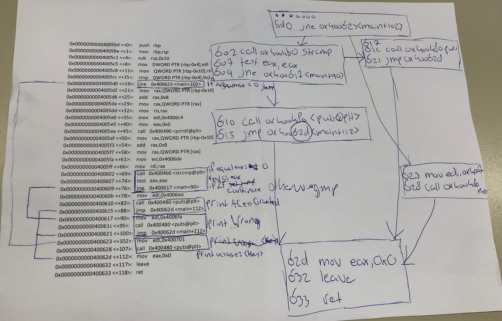

# [Reversing and Cracking first simple Program - bin 0x05](https://youtu.be/VroEiMOJPm8)
The folllowing files were provided by LifeOverflow to reverse and crack a simple program:
* [license_1.c](https://github.com/Zawadidone/Native-code/blob/master/binary-hacking/0x05/license_1.c)
* [lincense_1](https://github.com/Zawadidone/Native-code/blob/master/binary-hacking/0x05/license_1)

After using GDB I added the following comments to the assembler code, to explain the decisions made by the instructions:
```asm
Dump of assembler code for function main:
   0x00000000004005bd <+0>:     push   rbp
   0x00000000004005be <+1>:     mov    rbp,rsp
   0x00000000004005c1 <+4>:     sub    rsp,0x10
   0x00000000004005c5 <+8>:     mov    DWORD PTR [rbp-0x4],edi
   0x00000000004005c8 <+11>:    mov    QWORD PTR [rbp-0x10],rsi 
   0x00000000004005cc <+15>:    cmp    DWORD PTR [rbp-0x4],0x2
   0x00000000004005d0 <+19>:    jne    0x400623 <main+102> ; if argument 1 is none jmp to main+102
   0x00000000004005d2 <+21>:    mov    rax,QWORD PTR [rbp-0x10]
   0x00000000004005d6 <+25>:    add    rax,0x8
   0x00000000004005da <+29>:    mov    rax,QWORD PTR [rax]
   0x00000000004005dd <+32>:    mov    rsi,rax
   0x00000000004005e0 <+35>:    mov    edi,0x4006c4
   0x00000000004005e5 <+40>:    mov    eax,0x0
   0x00000000004005ea <+45>:    call   0x400490 <printf@plt> ; print "Checking License:"
   0x00000000004005ef <+50>:    mov    rax,QWORD PTR [rbp-0x10]
   0x00000000004005f3 <+54>:    add    rax,0x8
   0x00000000004005f7 <+58>:    mov    rax,QWORD PTR [rax]
   0x00000000004005fa <+61>:    mov    esi,0x4006da
   0x00000000004005ff <+66>:    mov    rdi,rax
   0x0000000000400602 <+69>:    call   0x4004b0 <strcmp@plt> ; run strcmp on argument 1
   0x0000000000400607 <+74>:    test   eax,eax ; executes a and bitwise operation: and 1, {first argument} : if result is 0 ZF is set
   0x0000000000400609 <+76>:    jne    0x400617 <main+90> ; if ZF is not set jmp to 617
   0x000000000040060b <+78>:    mov    edi,0x4006ea
   0x0000000000400610 <+83>:    call   0x400480 <puts@plt> ; prints "Access Granted!"
   0x0000000000400615 <+88>:    jmp    0x40062d <main+112>
   0x0000000000400617 <+90>:    mov    edi,0x4006fa
   0x000000000040061c <+95>:    call   0x400480 <puts@plt> ; prints "WRONG!"
   0x0000000000400621 <+100>:   jmp    0x40062d <main+112>
   0x0000000000400623 <+102>:   mov    edi,0x400701
   0x0000000000400628 <+107>:   call   0x400480 <puts@plt> ; prints "Usage: <key>"
   0x000000000040062d <+112>:   mov    eax,0x0
   0x0000000000400632 <+117>:   leave
   0x0000000000400633 <+118>:   ret
End of assembler dump.
```

Before that I drawed the decisions made by the instructions on paper:



The following instructions check if the license is correct with the use of strcmp:
```asm
0x0000000000400602 <+69>:    call   0x4004b0 <strcmp@plt> ; run strcmp on argument 1
0x0000000000400607 <+74>:    test   eax,eax ; executes a and bitwise operation: and 1, {first argument} : if result is 0 ZF is set
0x0000000000400609 <+76>:    jne    0x400617 <main+90> ; if ZF is not set jmp to 617
0x000000000040060b <+78>:    mov    edi,0x4006ea
0x0000000000400610 <+83>:    call   0x400480 <puts@plt> ; prints "Access Granted!"
```
If the zeroflag is not set (if eax=1) the jne jumps to address 617 and prints "WRONG!". To "crack" the program the result of the bitwise operation and on address 607 should be 0, then the ZF is set and the jump doesn't happen and the program continues execution of instructions. This could also be done by just enabling the ZF.

With the help of GDB I have set eax to the value 0. That is why the ZF is set and the jump does not happen and the program prints "Access Granted!":
```gdb
0x0000000000400607 in main ()
(gdb) p $eflags
$7 = [ IF ]
(gdb) set $eax=0
(gdb) ni
0x0000000000400609 in main ()
(gdb) p $eflags
$8 = [ PF ZF IF ]
[...]
Access Granted!
```
